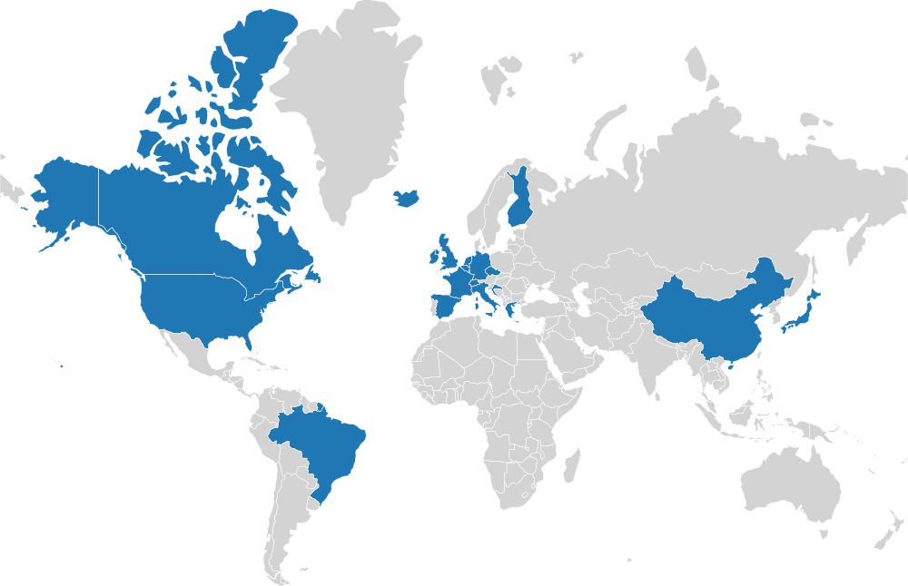

# Visited Countries Map
This project can be used to quickly generate easy map to display where you've traveled.

## Requirements
This project requires `GeoPandas` installed to function. The map themselves are stored in `data/`.

## Usage
```python
from countries_visited_map import CountriesVisitedMap
map = CountriesVisitedMap()

map.add_country('Germany', 1990, status='Lived in')
map.add_country('Canada', 2014, status='Lived in')
map.add_country('United States', 2016)
map.add_country('Brazil', 2017)
map.add_country('China', 2026, status='Planned')

map.plot_status()
map.save('map.png')
```

## Available maps

### `plot_status()`
This countries are colored according to the statuses you assigned them ("Visited by default").


### `plot()`
All countries are displayed in the same color.



### `plot_timeline()`
Plot a timeline of the countries you visited. Relies on the `year` argument you use when adding countries (countries will not be displayed if you didn't specify a year).


## API 
```python
def plot(self [,color] [,edgecolor] [,background_color]):
    """Plot the map. All the countries are highlighted in the same color.

    Args:
        color (string, optional): Color countries are highlighted with (as recognized by matplotlib).Defaults to DEFAULT_COLOR.
        edgecolor (string, optional): Color of the borders between countries. Defaults to EDGE_COLOR.
        background_color (string, optional): Color countries not highlighted are displayed in. Defaults to BACKGROUND_COLOR.
    """
    
def plot_status(self [,colors] [,edgecolor] [,background_color]):
    """Plot the map with countries in different colors according to the status given to them.

    Args:
        colors (list[string], optional): List of string recognized by matplotlib. The color will be applied in alphabetical order.             Defaults to COLOR_MAP.
        edgecolor (string, optional): Color of the border between countries. Defaults to EDGE_COLOR.
        background_color (string, optional): Color countries not highlighted are displayed in. Defaults to BACKGROUND_COLOR.
    """
    
def plot_timeline(self [,cmap] [,edgecolor]):
    """Plot the timeline of the map. Only uses entries that were supplied a year.

    Args:
        cmap (str, optional): Valid matplotlib color map. Defaults to 'autumn'.
        edgecolor (str, optional): Valid matplotlib color. Defaults to EDGE_COLOR.
    """
    

def save(self, filepath:str [,transparent]):
    """Saves the latest map plotted.

    Args:
        filepath (str): image filepath
        transparent (bool, optional): Should the background be transparent. Defaults to True.
    """
```